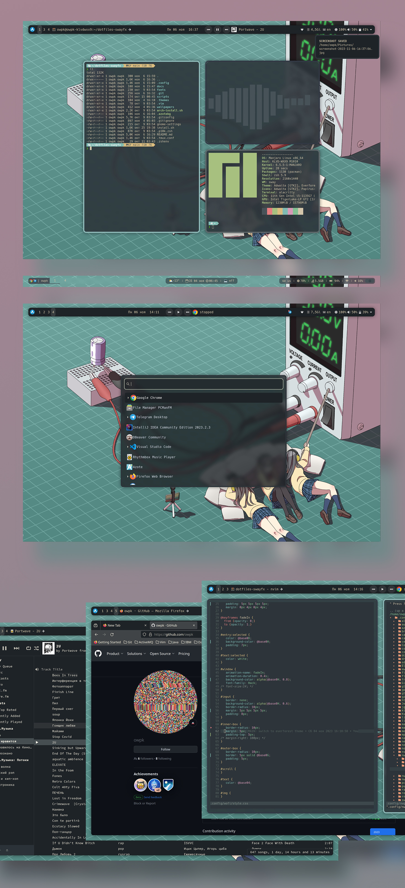
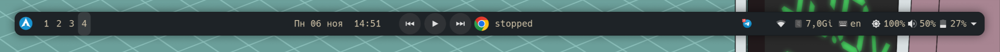
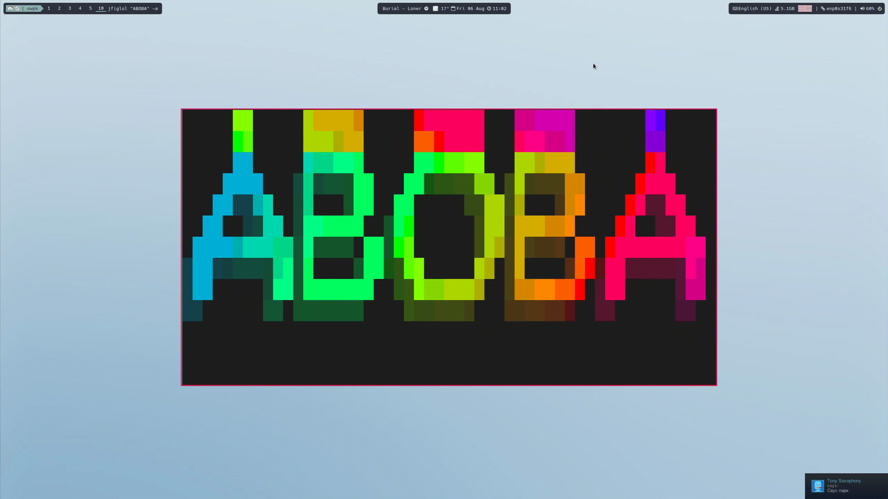

##  My configs for [swayfx](https://github.com/WillPower3309/swayfx) (sway fork)
## ❤️ This dotfiles fully compatible with vanilla sway, just remove ```./config/sway/config.d/swayfx``` config file
### Also check my '[sway keybindings helper](https://github.com/owpk/sway-keyhints)' project  

- press ```Win + p``` to show keybindigs help

<p align=center style="margin-top:36px">	  
  
  
</p>

<p align="center">
   
</p>

# 🗿 Info
- [sway fx (windows manager)](https://github.com/WillPower3309/swayfx)
- [waybar (status bar)](https://github.com/Alexays/Waybar) 
- [nwg-panel (status bar)](https://github.com/nwg-piotr/nwg-panel) Optional
- [nwg-launchers (menus/launchers)](https://github.com/nwg-piotr/nwg-launchers)
- [wofi (menus/launchers)](https://hg.sr.ht/~scoopta/wofi)
- [mako (wayland notification daemon)](https://github.com/emersion/mako)
- [avizo (wayland overlay bar)](https://github.com/misterdanb/avizo)
- [aura (AUR helper)](https://github.com/fosskers/aura)
- [alacritty (shell)](https://github.com/alacritty/alacritty)
- [wf-recorder (screen recording)](https://github.com/ammen99/wf-recorder)
- [wl-clipboard (clipboard)](https://github.com/bugaevc/wl-clipboard)
- [swww (wallpaper daemon)](https://github.com/LGFae/swww)
- [ranger (file manager)](https://github.com/ranger/ranger)

# 🚀 Automatically installation
You can use installation script (using 'yay' package manager to resolve dependencies) 
```bash
curl -L https://raw.githubusercontent.com/owpk/dotfiles-swayfx/main/install.sh | bash
```

# 🚀 Manual installation for arch based distros (copy and paste to terminal)
1. install all needed apps
```
sudo pacman -S --needed swaybg jq cmake cmocka ranger wofi waybar mtools vim neovim zsh \
papirus-icon-theme noto-fonts-emoji wl-clipboard translate-shell slurp \
grim pamixer wmname xdg-desktop-portal-wlr xdg-desktop-portal-gtk kanshi alacritty \
kitty pavucontrol playerctl imv mpv wayvnc swayidle mako gnome-themes-extra \
gtk-engine-murrine ttf-jetbrains-mono ttf-nerd-fonts-symbols

sudo usermod -a -G video $USER
```
2. clone dotfiles and change current directory to project directory (do any steps below from it)
```
git clone https://github.com/owpk/dotfiles-swayfx
cd dotfiles-swayfx
```
3. change shell to zsh
```
chsh -s /bin/zsh $USER
```
4. create your config backups if needed (hide errors)
```
mkdir ~/sway_backups.old

mv ~/.zshenv ~/sway_backups.old/.zshenv.bak 2> /dev/null
mv ~/.zshrc ~/sway_backups.old/.zshrc.bak 2> /dev/null
mv ~/.p10k.zsh ~/sway_backups.old/.p10k.zsh.bak 2> /dev/null
mv ~/.config ~/sway_backups.old/.config.bak 2> /dev/null
mv ~/.vim ~/sway_backups.old/.vim.bak 2> /dev/null
mv ~/.themes/ ~/sway_backups.old/.themes.bak 2> /dev/null
mv ~/.azotebg ~/sway_backups.old/.azote.bak 2> /dev/null

sudo pacman -R --no-confirm xterm
```
4.1 create all needed links and copy fonts
```
sudo mkdir /usr/share/fonts/TTF 2> /dev/null
sudo cp ./fonts/* /usr/share/fonts/TTF/
sudo cp ./config/sway/scripts/floating /usr/local/bin

fc-cache

ln -s `pwd`/.config ~/.config
ln -s `pwd`/.themes ~/.themes
ln -s /bin/alacritty /bin/xterm
```

5. install 'yay' package manager

```
pacman -Sy --needed git base-devel
git clone https://aur.archlinux.org/yay.git
cd yay
makepkg -si
```

6. install menus/toolbars/utils etc for sway
 - use ```gpg --receive-keys``` if any errors occures

```
yay -S --needed swww avizo nwg-launchers nwg-panel wlsunset sworkstyle audio-recorder waybar-mpris-git
```
---
(Optional) install ranger devicons
```
git clone https://github.com/alexanderjeurissen/ranger_devicons ~/.config/ranger/plugins/ranger_devicons
```
---

Reboot your system

# Configuration
 - default sway config: ```~/.config/sway/config```

```
include $HOME/.config/sway/config.d/*
include /etc/sway/outputs/*
```
### status bar
- edit ```~/.config/sway/config.d/10-autostart-applications``` config file:

```waybar``` 
<p align="center">
   
</p>

>comment ```nwg-panel``` to enable ```waybar```
```
#exec_always nwg-panel
```
```nwg-panel```

<p align="center">
   
</p>  

>comment ```waybar``` to enable ```nwg-panel ```  

```
bar {
   #swaybar_command waybar
}
```
### keyboard

- edit ```.config/sway/config.d/input``` to change keyboard layout and other kb settings
- edit ```.config/sway/config.d/default``` to change key bindings config

### change output properties ([check man page for more info](https://manpages.debian.org/experimental/sway/sway-output.5.en.html))
- create config file in ```/etc/sway/outputs/example```  
example:
```
# Default wallpaper
output * scale 1.3
```

# Issues
- vmware: black screen after sway launch   
	adding WLR_NO_HARDWARE_CURSORS=1 to /etc/environment may fix the problem

---
<p align="center">
   
</p>
