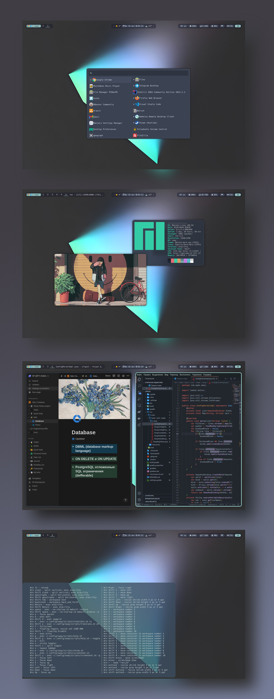

##  My configs for [swayfx](https://github.com/WillPower3309/swayfx) (sway fork)
## This dotfiles compatible with vanilla sway, just remove ./config/sway/config.d/swayfx config
### Also check my '[sway keybindings helper](https://github.com/owpk/sway-keyhints)' project  

- press ```Win + p``` to show keybindigs help
- press ```Win + Shift + p``` to toggle keybindigs help 
- SEE .config/sway/config.d/input TO CHANGE KEYBOARD LAYOUT AND OTHER KB SETTINGS
- SEE .config/sway/config.d/default TO CHANGE KEY BINDINGS CONFIG

<p align=center style="margin-top:36px">	  
  
  
</p>

<p align="center">
   
</p>
<p align="center">
   
</p>

# 🗿 Info
- [sway fx (windows manager)](https://github.com/WillPower3309/swayfx)
- [waybar (status bar)](https://github.com/Alexays/Waybar)
- [wofi (menus/launchers)](https://hg.sr.ht/~scoopta/wofi)
- [mako (wayland notification daemon)](https://github.com/emersion/mako)
- [nwg-launchers (menus/launchers)](https://github.com/nwg-piotr/nwg-launchers)
- [avizo (wayland overlay bar)](https://github.com/misterdanb/avizo)
- [aura (AUR helper)](https://github.com/fosskers/aura)
- [alacritty (shell)](https://github.com/alacritty/alacritty)
- [wf-recorder (screen recording)](https://github.com/ammen99/wf-recorder)
- [wl-clipboard (clipboard)](https://github.com/bugaevc/wl-clipboard)
- [ranger (file manager)](https://github.com/ranger/ranger)

# 🚀 Install for arch based distros (copy and paste to terminal)

1. install all needed apps
```
sudo pacman -S --needed swaybg jq cmake cmocka ranger wofi waybar mtools vim neovim zsh \
vifm papirus-icon-theme noto-fonts-emoji ttf-hack wl-clipboard translate-shell slurp \
grim light pamixer wmname dmenu xdg-desktop-portal kanshi alacritty \
kitty pavucontrol playerctl imv mpv wayvnc pkcs11-helper nodejs swayidle

sudo usermod -a -G video $USER
```
2. clone dotfiles and change current directory to project directory (do any steps below from it)
```
git clone https://github.com/owpk/dotfiles-swayfx
cd dotfiles-swayfx
```
3. change shell to zsh
```
chsh -s /bin/zsh $USER
```
4. create your config backups if needed (hide errors)
```
mkdir ~/sway_backups.old

mv ~/.zshenv ~/sway_backups.old/.zshenv.bak 2> /dev/null
mv ~/.zshrc ~/sway_backups.old/.zshrc.bak 2> /dev/null
mv ~/.p10k.zsh ~/sway_backups.old/.p10k.zsh.bak 2> /dev/null
mv ~/.config ~/sway_backups.old/.config.bak 2> /dev/null
mv ~/.vim ~/sway_backups.old/.vim.bak 2> /dev/null
```
4.1 create all needed links and copy fonts
```
sudo mkdir /usr/share/fonts/TTF 2> /dev/null
sudo cp ./fonts/* /usr/share/fonts/TTF/
fc-cache
ln -s `pwd`/.zshenv ~/.zshenv
ln -s `pwd`/.config/zsh/.zshrc ~/.zshrc
ln -s `pwd`/.p10k.zsh ~/.p10k.zsh
ln -s `pwd`/.config ~/.config
ln -s `pwd`/.vim ~/.vim
```

5. install 'aura'

```
git clone https://aur.archlinux.org/aura-bin.git
cd aura-bin
makepkg
sudo pacman -U *.tar.zst
```

6. install menus/toolbars/utils etc for sway
 - use ```gpg --receive-keys``` if any errors occures
```
sudo aura -A avizo
sudo aura -A nwg-launchers
sudo aura -A nwg-wrapper
sudo aura -A wlsunset
sudo aura -A sworkstyle
sudo aura -A azote
```

6.1 (Optional) install ranger devicons
```
git clone https://github.com/alexanderjeurissen/ranger_devicons ~/.config/ranger/plugins/ranger_devicons
```
6.2 (Optional) change output properties ([check man page for more info](https://manpages.debian.org/experimental/sway/sway-output.5.en.html))
- create config file in '/etc/sway/outputs/example'

example:
```
# Default wallpaper
output * scale 1.3
```

#### 🐥 Use [azote](https://github.com/nwg-piotr/azote) application to change background image 

# Issues
- vmware: black screen after sway launch   
	adding WLR_NO_HARDWARE_CURSORS=1 to /etc/environment may fix the problem

